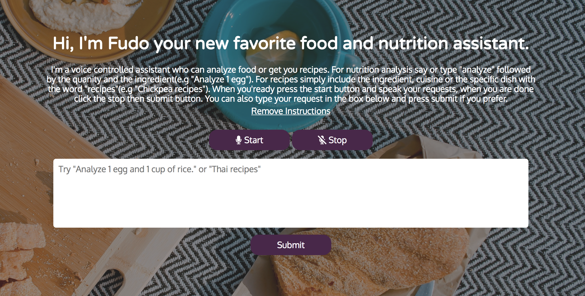

# Fudo
The Fudo app is a voice controlled food and nutrition assistant.  Currently it can search for recipes based on different parameters like cuisine, dish, or ingredient.  It can also analyze the nutrition of any ingredient or combination of ingredients.  
# Motivation
I wanted a voice controlled app that could analyze the nutritional composition of any meal as well as perform other helpful tasks like help me discover new recipes. 
# Screenshots
Landing Page

Speech Recognition 

Nutrition Analysis

Recipes

# Built With 
HTML, CSS, Javascript, jQuery

# Live Demo
<a href="https://kevinasuncion.github.io/fudo/">DEMO</a>

# Features
<ul>
  <li>Recipe Discovery</li>
  <li>Nutritional Analysis</li>
</ul>

# How To Use Fudo
<ol>
<li>Speech Recognition is only available in Chrome, so if you'd like to use that feature, open the app up in Chrome. However the app can be used without speech.</li>
<li>Press the start button and allow Chrome to use your microphone, then say your request.</li>
<li>If you'd like to search for recipes, include the keyword "recipes" in your request, for example you can say "Thai recipes", "Chicken Teriyaki Recipes" or "Sweet Potato Recipes." </li>
<li>If you'd like a nutritional analysis include the keyword "analyze" followed by the quantity and the ingredient (e.g. 1 medium sweet potato). It can also take multiple foods at the same time so you can chain on other foods, try "Analyze 1 large egg, 1 cup of rice and 1 cup of spinach."</li>
</ol>
